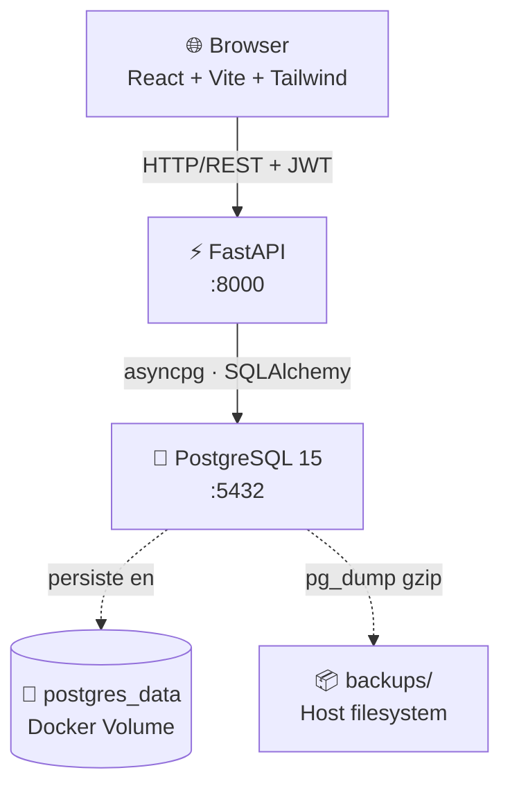
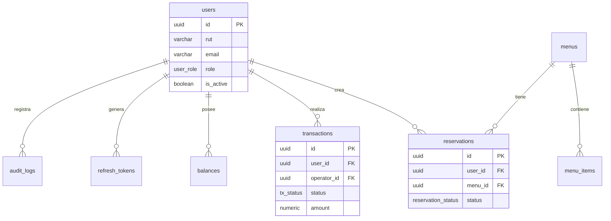

# Casino VjF

Sistema de gestión de casino con transacciones financieras, reservas de menú y control de acceso por roles.

**Stack:** FastAPI · PostgreSQL 15 · Docker · React/Vite · Alembic

---

## Arquitectura del Sistema



### Componentes

| Componente | Tecnología | Puerto | Descripción |
|---|---|---|---|
| Frontend | React 18 + Vite + Tailwind | 5173 (dev) | SPA de administración y consumo |
| API | FastAPI + Uvicorn | 8000 | REST API con JWT, rate limiting y audit log |
| Base de datos | PostgreSQL 15 Alpine | 5432 | Datos financieros y operativos |
| Migraciones | Alembic | — | Control de versiones del schema |

### Schema de base de datos



---

## Requisitos Previos

| Herramienta | Versión mínima | Verificación |
|---|---|---|
| Docker Desktop | 4.x | `docker --version` |
| WSL 2 | 2.7+ | `wsl --version` |
| PowerShell | 5.1+ | `$PSVersionTable.PSVersion` |
| Git | cualquiera | `git --version` |

> **WSL 2:** Si Docker Desktop lo solicita al iniciar, ejecuta `wsl --update` en PowerShell como Administrador y reinicia Docker Desktop.

---

## Guía de Despliegue

### Primera instalación

```powershell
# 1. Clonar el repositorio
git clone <url-del-repo>
cd "Todo VjF"

# 2. Crear el archivo .env raíz
@"
DB_USER=casino_app
DB_PASSWORD=<contraseña-segura>
DB_NAME=casino_db
"@ | Set-Content .env

# 3. Revisar y completar casino_app/.env (JWT secret, etc.)
notepad casino_app\.env

# 4. Ejecutar el script de despliegue (sin backup en primera instalación)
.\scripts\setup.ps1 -SkipBackup
```

### Re-deploy / actualización

```powershell
# Incluye backup automático antes de aplicar migraciones
.\scripts\setup.ps1
```

### Flags disponibles

| Flag | Descripción |
|---|---|
| *(ninguno)* | Despliegue normal con backup automático previo |
| `-SkipBackup` | Omite el backup (solo primera instalación limpia) |
| `-Verbose` | Muestra output completo de Docker |

### Qué hace `setup.ps1` paso a paso

```
[1] Verifica Docker Desktop activo
[2] Valida variables DB_USER, DB_PASSWORD, DB_NAME en .env
[3] Backup automático si ya existen datos (postgres_data volume)
[4] docker compose up -d --build
[5] Espera healthcheck de PostgreSQL (máx 60s)
[6] Ejecuta init_db.sql solo si el schema casino no existe
[7] alembic upgrade head dentro del contenedor API
[8] Smoke test GET /health → {"status":"ok"}
```

---

## Variables de Entorno

### `.env` raíz — usado por `docker-compose.yml`

| Variable | Requerida | Descripción |
|---|---|---|
| `DB_USER` | ✅ | Usuario de PostgreSQL |
| `DB_PASSWORD` | ✅ | Contraseña del usuario |
| `DB_NAME` | ✅ | Nombre de la base de datos |

### `casino_app/.env` — usado por la API

| Variable | Default | Descripción |
|---|---|---|
| `DB_HOST` | `localhost` | Host BD (Docker lo sobreescribe a `db`) |
| `DB_PORT` | `5432` | Puerto BD |
| `JWT_SECRET_KEY` | — | Mínimo 32 caracteres |
| `ACCESS_TOKEN_EXPIRE_MINUTES` | `15` | TTL del access token |
| `REFRESH_TOKEN_EXPIRE_DAYS` | `7` | TTL del refresh token |
| `ENVIRONMENT` | `production` | `development` / `production` |
| `LOG_LEVEL` | `INFO` | Nivel de log (`DEBUG`, `INFO`, `WARNING`) |

Generar un JWT secret seguro:
```powershell
python -c "import secrets; print(secrets.token_hex(32))"
```

---

## Mantenimiento

### Logs en tiempo real

```powershell
# API
docker compose logs -f api

# Base de datos
docker compose logs -f db

# Ambos servicios
docker compose logs -f
```

### Backup bajo demanda

```powershell
# Backup estándar (retiene últimos 7)
.\scripts\backup.ps1

# Retener últimos 30 backups
.\scripts\backup.ps1 -Keep 30

# Directorio personalizado
.\scripts\backup.ps1 -OutputDir "D:\backups\casino"
```

Los backups se guardan en `backups\YYYY-MM-DD_HH-mm.sql.gz`.

### Restore de un backup

```powershell
# Detener la API para evitar escrituras durante el restore
docker compose stop api

# Restaurar backup
$backup = "backups\2026-06-03_14-00.sql.gz"
Get-Content $backup -Raw | docker exec -i todovjf-db-1 sh -c "gunzip | psql -U casino_app -d casino_db"

# Reiniciar la API
docker compose start api
```

### Actualizar dependencias

```powershell
# Tras cambios en casino_app/requirements.txt
docker compose build api
.\scripts\setup.ps1
```

### Detener el sistema

```powershell
# Detener contenedores (conserva datos)
docker compose down

# ⚠️ DESTRUCTIVO — elimina todos los datos
docker compose down -v
```

---

## Seguridad e Integridad de Datos

### Persistencia con volúmenes Docker

Los datos de PostgreSQL se almacenan en el volumen `todovjf_postgres_data`:

```powershell
# Verificar que el volumen existe y su ubicación
docker volume inspect todovjf_postgres_data
```

> `docker compose down` **NO** elimina el volumen. Se requiere `-v` explícito — usar con extrema precaución en producción.

### Política de backups

| Aspecto | Configuración |
|---|---|
| Backup automático | Antes de cada `alembic upgrade head` via `setup.ps1` |
| Backup manual | `.\scripts\backup.ps1` |
| Retención default | Últimos 7 backups |
| Formato | `.sql.gz` (pg_dump + gzip) |
| Ubicación | `.\backups\` en el host |

**Recomendación producción:** copiar `.\backups\` a almacenamiento externo (NAS, Azure Blob Storage, S3) con retención mínima de 30 días.

### Acceso mínimo privilegio

El usuario `casino_app` opera con permisos acotados sobre el schema `casino`:

| Tabla | SELECT | INSERT | UPDATE | DELETE |
|---|---|---|---|---|
| `users`, `menus`, `reservations` | ✅ | ✅ | ✅ | ✅ |
| `transactions` | ✅ | ✅ | ✅ | ❌ revocado |
| `audit_logs` | ✅ | ✅ | ✅ | ❌ revocado |

`transactions` y `audit_logs` son inmutables por diseño — garantía de integridad financiera.

---

## Troubleshooting

| Error | Causa probable | Solución |
|---|---|---|
| `Docker Desktop is unable to start` | WSL 2 desactualizado | `wsl --update` como Admin, reiniciar |
| `DB_USER variable is not set` | `.env` raíz vacío o faltante | Crear `.env` con las 3 variables requeridas |
| `relation "casino.users" does not exist` | Primera vez, schema vacío | `.\scripts\setup.ps1 -SkipBackup` |
| `alembic upgrade head` falla | Conflicto de migraciones | `docker exec todovjf-api-1 alembic history` |
| API en bucle de reinicios (`Restarting`) | Error de conexión a BD o config | `docker compose logs api` para diagnóstico |
| `/health` no responde tras deploy | API aún iniciando | Esperar 15s, luego `docker compose logs -f api` |
| Backup vacío (0 bytes) | Contenedor detenido durante dump | Verificar `docker ps`, reintentar |
