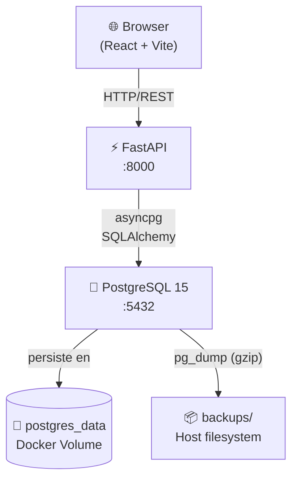

# DevOps Setup & Documentation — Implementation Plan

> **For agentic workers:** REQUIRED SUB-SKILL: Use superpowers:executing-plans to implement this plan task-by-task.

**Goal:** Crear `scripts/backup.ps1`, `scripts/setup.ps1` y `README.md` profesional para despliegue de producción en Windows.

**Architecture:** Script modular con orquestador (`setup.ps1`) que invoca un backup idempotente antes de cada migración. `backup.ps1` es autónomo. `README.md` documenta arquitectura, despliegue y mantenimiento con diagrama Mermaid.

**Tech Stack:** PowerShell 5.1, Docker Desktop, PostgreSQL 15, FastAPI, Alembic, Mermaid

---

## File Map

| Archivo | Acción | Responsabilidad |
|---|---|---|
| `scripts/backup.ps1` | Crear | Dump pg_dump comprimido + retención |
| `scripts/setup.ps1` | Crear | Orquestador de despliegue idempotente |
| `README.md` | Crear | Documentación técnica profesional |
| `backups/.gitkeep` | Crear | Mantiene el directorio en git |

---

## Task 1: `scripts/backup.ps1`

**Files:**
- Create: `scripts/backup.ps1`

- [ ] **Step 1: Crear `scripts/backup.ps1` con el siguiente contenido**

```powershell
<#
.SYNOPSIS
    Backup de PostgreSQL para Casino VjF.
.DESCRIPTION
    Genera un dump comprimido (.sql.gz) de la base de datos dentro del
    contenedor todovjf-db-1. Elimina backups antiguos conservando los
    últimos -Keep archivos.
.PARAMETER Keep
    Número de backups a retener. Default: 7.
.PARAMETER OutputDir
    Directorio de destino. Default: .\backups (relativo a la raíz del proyecto).
.EXAMPLE
    .\backup.ps1
    .\backup.ps1 -Keep 30
    .\backup.ps1 -OutputDir "D:\backups\casino"
#>
param(
    [int]$Keep = 7,
    [string]$OutputDir = ""
)

Set-StrictMode -Version Latest
$ErrorActionPreference = "Stop"

# ── Rutas ────────────────────────────────────────────────────────────────────
$ProjectRoot = Split-Path -Parent $PSScriptRoot
if ([string]::IsNullOrWhiteSpace($OutputDir)) {
    $OutputDir = Join-Path $ProjectRoot "backups"
}

# ── Helpers ──────────────────────────────────────────────────────────────────
function Write-Step { param([string]$Msg) Write-Host "[....] $Msg" -ForegroundColor Cyan }
function Write-Ok   { param([string]$Msg) Write-Host "[ OK ] $Msg" -ForegroundColor Green }
function Write-Fail { param([string]$Msg) Write-Host "[FAIL] $Msg" -ForegroundColor Red; exit 1 }

# ── Leer .env ────────────────────────────────────────────────────────────────
$EnvFile = Join-Path $ProjectRoot ".env"
if (-not (Test-Path $EnvFile)) { Write-Fail ".env no encontrado en $ProjectRoot" }

$EnvVars = @{}
Get-Content $EnvFile | ForEach-Object {
    if ($_ -match "^\s*([^#][^=]*?)\s*=\s*(.*)\s*$") {
        $EnvVars[$Matches[1]] = $Matches[2]
    }
}
$DbUser = $EnvVars["DB_USER"]
$DbName = $EnvVars["DB_NAME"]

if ([string]::IsNullOrWhiteSpace($DbUser) -or [string]::IsNullOrWhiteSpace($DbName)) {
    Write-Fail "DB_USER o DB_NAME no definidos en .env"
}

# ── Step 1: Validar contenedor ────────────────────────────────────────────────
Write-Step "Verificando contenedor todovjf-db-1..."
$running = docker inspect --format "{{.State.Running}}" todovjf-db-1 2>$null
if ($running -ne "true") { Write-Fail "El contenedor todovjf-db-1 no está corriendo." }
Write-Ok "Contenedor activo."

# ── Step 2: Crear directorio ──────────────────────────────────────────────────
if (-not (Test-Path $OutputDir)) {
    New-Item -ItemType Directory -Path $OutputDir | Out-Null
    Write-Ok "Directorio creado: $OutputDir"
}

# ── Step 3: Generar nombre y ejecutar pg_dump ─────────────────────────────────
$Timestamp = Get-Date -Format "yyyy-MM-dd_HH-mm"
$Filename  = "$Timestamp.sql.gz"
$Filepath  = Join-Path $OutputDir $Filename

Write-Step "Ejecutando pg_dump → $Filename ..."
docker exec todovjf-db-1 sh -c "pg_dump -U $DbUser $DbName | gzip" | Set-Content -Path $Filepath -Encoding Byte
if ($LASTEXITCODE -ne 0) { Write-Fail "pg_dump falló (exit $LASTEXITCODE)." }

# ── Step 4: Verificar integridad ──────────────────────────────────────────────
$FileSize = (Get-Item $Filepath).Length
if ($FileSize -eq 0) {
    Remove-Item $Filepath -Force
    Write-Fail "El archivo de backup está vacío. Se eliminó."
}
$FileSizeKb = [Math]::Round($FileSize / 1KB, 1)
Write-Ok "Backup generado: $Filepath ($FileSizeKb KB)"

# ── Step 5: Retención ─────────────────────────────────────────────────────────
$AllBackups = Get-ChildItem $OutputDir -Filter "*.sql.gz" | Sort-Object LastWriteTime -Descending
if ($AllBackups.Count -gt $Keep) {
    $ToDelete = $AllBackups | Select-Object -Skip $Keep
    $ToDelete | Remove-Item -Force
    Write-Ok "Retención aplicada: se eliminaron $($ToDelete.Count) backup(s) antiguo(s). Se conservan $Keep."
}

Write-Host ""
Write-Host "  Backup completado exitosamente." -ForegroundColor Green
Write-Host "  Archivo : $Filepath"
Write-Host "  Tamaño  : $FileSizeKb KB"
Write-Host "  Total   : $([Math]::Min($AllBackups.Count, $Keep)) backup(s) retenidos en $OutputDir"
Write-Host ""
exit 0
```

- [ ] **Step 2: Verificar sintaxis del script**

```powershell
powershell -NoProfile -Command "& { . 'scripts\backup.ps1' -WhatIf }" 2>&1
```
No debe arrojar errores de parsing. Si el contenedor no está corriendo simplemente imprimirá `[FAIL]` — eso es correcto.

- [ ] **Step 3: Commit**

```bash
git add scripts/backup.ps1
git commit -m "feat: add backup.ps1 with retention and integrity check"
```

---

## Task 2: `scripts/setup.ps1`

**Files:**
- Create: `scripts/setup.ps1`

- [ ] **Step 1: Crear `scripts/setup.ps1` con el siguiente contenido**

```powershell
<#
.SYNOPSIS
    Despliega Casino VjF en un servidor Windows de producción/staging.
.DESCRIPTION
    Idempotente: detecta el estado actual y solo aplica lo que falta.
    Hace backup automático antes de migrar si ya existe datos previos.
.PARAMETER SkipBackup
    Omite el backup previo (usar solo en primera instalación limpia).
.PARAMETER Verbose
    Muestra output completo de cada comando Docker.
.EXAMPLE
    .\setup.ps1
    .\setup.ps1 -SkipBackup
    .\setup.ps1 -Verbose
#>
param(
    [switch]$SkipBackup,
    [switch]$Verbose
)

Set-StrictMode -Version Latest
$ErrorActionPreference = "Stop"

# ── Rutas ────────────────────────────────────────────────────────────────────
$ProjectRoot = Split-Path -Parent $PSScriptRoot
$BackupScript = Join-Path $PSScriptRoot "backup.ps1"
$EnvFile      = Join-Path $ProjectRoot ".env"
$InitSql      = Join-Path $ProjectRoot "casino_app\scripts\init_db.sql"

# ── Helpers ──────────────────────────────────────────────────────────────────
function Write-Step { param([string]$Msg) Write-Host "`n[....] $Msg" -ForegroundColor Cyan }
function Write-Ok   { param([string]$Msg) Write-Host "[ OK ] $Msg" -ForegroundColor Green }
function Write-Warn { param([string]$Msg) Write-Host "[WARN] $Msg" -ForegroundColor Yellow }
function Write-Fail { param([string]$Msg) Write-Host "[FAIL] $Msg" -ForegroundColor Red; exit 1 }

Write-Host ""
Write-Host "=================================================" -ForegroundColor Magenta
Write-Host "   Casino VjF — Script de despliegue            " -ForegroundColor Magenta
Write-Host "=================================================" -ForegroundColor Magenta
Write-Host "  Fecha  : $(Get-Date -Format 'yyyy-MM-dd HH:mm:ss')"
Write-Host "  Proyecto: $ProjectRoot"
Write-Host ""

# ── Step 1: Verificar Docker ──────────────────────────────────────────────────
Write-Step "Verificando Docker..."
try {
    $dockerVer  = docker --version 2>&1
    $composeVer = docker compose version 2>&1
} catch {
    Write-Fail "Docker no encontrado o no está corriendo. Asegúrate de que Docker Desktop esté activo."
}
Write-Ok "Docker:         $dockerVer"
Write-Ok "Docker Compose: $composeVer"

# ── Step 2: Validar .env ──────────────────────────────────────────────────────
Write-Step "Validando variables de entorno (.env)..."
if (-not (Test-Path $EnvFile)) { Write-Fail ".env no encontrado en $ProjectRoot" }

$EnvVars = @{}
Get-Content $EnvFile | ForEach-Object {
    if ($_ -match "^\s*([^#][^=]*?)\s*=\s*(.*)\s*$") {
        $EnvVars[$Matches[1]] = $Matches[2]
    }
}
$Required = @("DB_USER", "DB_PASSWORD", "DB_NAME")
$Missing  = $Required | Where-Object { -not $EnvVars.ContainsKey($_) -or [string]::IsNullOrWhiteSpace($EnvVars[$_]) }
if ($Missing.Count -gt 0) {
    Write-Fail "Variables faltantes en .env: $($Missing -join ', ')"
}
Write-Ok "Variables requeridas presentes: $($Required -join ', ')"

$DbUser = $EnvVars["DB_USER"]
$DbName = $EnvVars["DB_NAME"]

# ── Step 3: Backup condicional ────────────────────────────────────────────────
if (-not $SkipBackup) {
    Write-Step "Verificando si existen datos previos..."
    $VolumeExists = docker volume ls --format "{{.Name}}" 2>$null | Where-Object { $_ -eq "todovjf_postgres_data" }
    if ($VolumeExists) {
        Write-Host "[INFO] Volumen postgres_data detectado. Ejecutando backup de seguridad..." -ForegroundColor Yellow
        & $BackupScript -Keep 7
        if ($LASTEXITCODE -ne 0) {
            Write-Fail "El backup falló. Deploy abortado para proteger los datos."
        }
    } else {
        Write-Ok "No hay datos previos. Se omite el backup."
    }
} else {
    Write-Warn "Flag -SkipBackup activo. Se omite el backup."
}

# ── Step 4: docker compose up ─────────────────────────────────────────────────
Write-Step "Levantando infraestructura (docker compose up -d --build)..."
Push-Location $ProjectRoot
try {
    if ($Verbose) {
        docker compose up -d --build
    } else {
        docker compose up -d --build 2>&1 | Out-Null
    }
    if ($LASTEXITCODE -ne 0) { Write-Fail "docker compose up falló." }
} finally {
    Pop-Location
}
Write-Ok "Contenedores iniciados."

# ── Step 5: Esperar healthcheck de db ────────────────────────────────────────
Write-Step "Esperando que PostgreSQL esté saludable (máx 60s)..."
$Timeout = 60
$Elapsed = 0
do {
    Start-Sleep -Seconds 2
    $Elapsed += 2
    $Health = docker inspect --format "{{.State.Health.Status}}" todovjf-db-1 2>$null
    Write-Host "   [$Elapsed s] Estado: $Health" -NoNewline
    Write-Host "`r" -NoNewline
} while ($Health -ne "healthy" -and $Elapsed -lt $Timeout)

if ($Health -ne "healthy") {
    Write-Fail "La base de datos no alcanzó estado healthy en ${Timeout}s. Revisa los logs: docker compose logs db"
}
Write-Ok "PostgreSQL healthy."

# ── Step 6: Init schema (idempotente) ────────────────────────────────────────
Write-Step "Verificando schema 'casino'..."
$SchemaExists = docker exec todovjf-db-1 psql -U $DbUser -d $DbName -tAc "SELECT 1 FROM information_schema.schemata WHERE schema_name = 'casino';" 2>$null
$SchemaExists = $SchemaExists.Trim()

if ($SchemaExists -ne "1") {
    Write-Host "[INFO] Schema 'casino' no encontrado. Ejecutando init_db.sql..." -ForegroundColor Yellow
    if (-not (Test-Path $InitSql)) { Write-Fail "No se encontró $InitSql" }
    Get-Content $InitSql | docker exec -i todovjf-db-1 psql -U $DbUser -d $DbName 2>&1 | Out-Null
    if ($LASTEXITCODE -ne 0) { Write-Fail "init_db.sql falló." }
    Write-Ok "Schema 'casino' inicializado."
} else {
    Write-Ok "Schema 'casino' ya existe. Se omite init_db.sql."
}

# ── Step 7: Alembic migrations ───────────────────────────────────────────────
Write-Step "Ejecutando migraciones Alembic..."
docker exec todovjf-api-1 alembic upgrade head
if ($LASTEXITCODE -ne 0) { Write-Fail "alembic upgrade head falló." }
Write-Ok "Migraciones aplicadas."

# ── Step 8: Smoke test ───────────────────────────────────────────────────────
Write-Step "Smoke test: GET /health..."
$ApiOk = $false
for ($i = 1; $i -le 5; $i++) {
    Start-Sleep -Seconds 2
    try {
        $Resp = Invoke-RestMethod -Uri "http://localhost:8000/health" -TimeoutSec 5
        if ($Resp.status -eq "ok") { $ApiOk = $true; break }
    } catch { }
}

Write-Host ""
Write-Host "=================================================" -ForegroundColor Magenta
if ($ApiOk) {
    Write-Host "   DEPLOY COMPLETADO EXITOSAMENTE              " -ForegroundColor Green
} else {
    Write-Host "   DEPLOY COMPLETADO (API aún iniciando)       " -ForegroundColor Yellow
}
Write-Host "=================================================" -ForegroundColor Magenta
Write-Host "  API     : http://localhost:8000"
Write-Host "  Swagger : http://localhost:8000/docs"
Write-Host ""
if (-not $ApiOk) {
    Write-Warn "La API no respondió a /health en 10s. Verifica con: docker compose logs -f api"
}
exit 0
```

- [ ] **Step 2: Verificar sintaxis**

```powershell
powershell -NoProfile -Command "Get-Content 'scripts\setup.ps1' | Out-Null; Write-Host 'Sintaxis OK'"
```

- [ ] **Step 3: Commit**

```bash
git add scripts/setup.ps1
git commit -m "feat: add setup.ps1 idempotent deployment orchestrator"
```

---

## Task 3: `backups/.gitkeep` y `.gitignore`

**Files:**
- Create: `backups/.gitkeep`
- Modify: `.gitignore`

- [ ] **Step 1: Crear `.gitkeep` para que git trackee el directorio**

```bash
New-Item -ItemType File "backups\.gitkeep"
```

- [ ] **Step 2: Agregar `backups/*.sql.gz` al `.gitignore` raíz**

Editar `.gitignore` para que quede:
```
.env
backups/*.sql.gz
```

- [ ] **Step 3: Commit**

```bash
git add backups/.gitkeep .gitignore
git commit -m "chore: track backups dir, ignore dump files"
```

---

## Task 4: `README.md`

**Files:**
- Create: `README.md`

- [ ] **Step 1: Crear `README.md` con el siguiente contenido**

```markdown
# Casino VjF

Sistema de gestión de casino con transacciones financieras, reservas de menú y control de acceso por roles.

**Stack:** FastAPI · PostgreSQL 15 · Docker · React/Vite · Alembic

---

## Arquitectura del Sistema



### Componentes

| Componente | Tecnología | Puerto | Descripción |
|---|---|---|---|
| Frontend | React 18 + Vite + Tailwind | 5173 (dev) | SPA de administración y consumo |
| API | FastAPI + Uvicorn | 8000 | REST API con JWT, rate limiting y audit log |
| Base de datos | PostgreSQL 15 Alpine | 5432 | Datos financieros y operativos |
| Migraciones | Alembic | — | Control de versiones del schema |

---

## Requisitos Previos

| Herramienta | Versión mínima | Verificación |
|---|---|---|
| Docker Desktop | 4.x | `docker --version` |
| WSL 2 | 2.7+ | `wsl --version` |
| PowerShell | 5.1+ | `$PSVersionTable.PSVersion` |
| Git | cualquiera | `git --version` |

> **WSL 2:** Si Docker Desktop lo solicita al iniciar, ejecuta `wsl --update` en PowerShell como Administrador y reinicia.

---

## Guía de Despliegue

### Primera instalación

```powershell
# 1. Clonar el repositorio
git clone <url-del-repo>
cd "Todo VjF"

# 2. Crear el archivo .env raíz
@"
DB_USER=casino_app
DB_PASSWORD=<contraseña-segura>
DB_NAME=casino_db
"@ | Set-Content .env

# 3. Revisar y completar casino_app/.env (JWT secret, etc.)
notepad casino_app\.env

# 4. Ejecutar el script de despliegue
.\scripts\setup.ps1 -SkipBackup
```

### Re-deploy / actualización

```powershell
# Incluye backup automático antes de migrar
.\scripts\setup.ps1
```

### Flags disponibles

| Flag | Descripción |
|---|---|
| *(ninguno)* | Despliegue normal con backup automático |
| `-SkipBackup` | Omite el backup (solo primera instalación) |
| `-Verbose` | Muestra output completo de Docker |

---

## Variables de Entorno

### `.env` raíz (usado por `docker-compose.yml`)

| Variable | Requerida | Descripción |
|---|---|---|
| `DB_USER` | ✅ | Usuario de PostgreSQL |
| `DB_PASSWORD` | ✅ | Contraseña del usuario |
| `DB_NAME` | ✅ | Nombre de la base de datos |

### `casino_app/.env` (usado por la API)

| Variable | Default | Descripción |
|---|---|---|
| `DB_HOST` | `localhost` | Host de BD (sobreescrito a `db` por Docker) |
| `DB_PORT` | `5432` | Puerto de BD |
| `JWT_SECRET_KEY` | — | Mínimo 32 caracteres |
| `ACCESS_TOKEN_EXPIRE_MINUTES` | `15` | TTL del access token |
| `REFRESH_TOKEN_EXPIRE_DAYS` | `7` | TTL del refresh token |
| `ENVIRONMENT` | `production` | Entorno (`development` / `production`) |
| `LOG_LEVEL` | `INFO` | Nivel de log |

---

## Mantenimiento

### Logs en tiempo real

```powershell
# API
docker compose logs -f api

# Base de datos
docker compose logs -f db

# Ambos
docker compose logs -f
```

### Backup bajo demanda

```powershell
# Backup estándar (retiene últimos 7)
.\scripts\backup.ps1

# Retener últimos 30 backups
.\scripts\backup.ps1 -Keep 30

# Directorio personalizado
.\scripts\backup.ps1 -OutputDir "D:\backups\casino"
```

### Restore de un backup

```powershell
# Descomprimir y restaurar
$backup = "backups\2026-06-03_14-00.sql.gz"
Get-Content $backup -Raw | docker exec -i todovjf-db-1 sh -c "gunzip | psql -U casino_app -d casino_db"
```

### Actualizar dependencias de la API

```powershell
# Reconstruir imagen tras cambios en requirements.txt
docker compose build api
.\scripts\setup.ps1
```

### Detener el sistema

```powershell
# Detener contenedores (conserva datos)
docker compose down

# Detener y eliminar datos (⚠️ destructivo)
docker compose down -v
```

---

## Seguridad e Integridad de Datos

### Persistencia con volúmenes Docker

Los datos de PostgreSQL se almacenan en el volumen Docker `todovjf_postgres_data`, mapeado a `/var/lib/postgresql/data` dentro del contenedor.

```powershell
# Verificar que el volumen existe
docker volume inspect todovjf_postgres_data
```

> `docker compose down` **NO** elimina el volumen. Solo `docker compose down -v` lo hace — usar con extrema precaución en producción.

### Política de backups

| Aspecto | Configuración |
|---|---|
| Backup automático | Antes de cada `alembic upgrade head` |
| Backup manual | `.\scripts\backup.ps1` |
| Retención default | Últimos 7 backups |
| Formato | `.sql.gz` (pg_dump comprimido) |
| Ubicación | `.\backups\` en el host |

**Recomendación para producción:** mover `.\backups\` a almacenamiento externo (NAS, S3, Azure Blob) con retención ≥ 30 días.

### Acceso mínimo privilegio

El usuario `casino_app` tiene permisos acotados sobre el schema `casino`:
- `SELECT, INSERT, UPDATE` en todas las tablas
- `DELETE` revocado en `transactions` y `audit_logs` (inmutabilidad financiera)
- Sin acceso a tablas del sistema

---

## Troubleshooting

| Error | Causa probable | Solución |
|---|---|---|
| `Docker Desktop is unable to start` | WSL 2 desactualizado | `wsl --update`, reiniciar |
| `DB_USER variable is not set` | `.env` raíz vacío | Crear `.env` con las 3 variables requeridas |
| `relation "casino.users" does not exist` | Primera vez, schema vacío | Ejecutar `.\scripts\setup.ps1 -SkipBackup` |
| `alembic upgrade head` falla | Migraciones con conflicto | `docker exec todovjf-api-1 alembic history` |
| API en bucle de reinicios | Error de conexión a BD | `docker compose logs api` para diagnóstico |
| `/health` no responde | API aún iniciando | Esperar 10-15s, verificar logs |
```

- [ ] **Step 2: Verificar que el archivo se creó correctamente**

```powershell
Get-Item README.md
(Get-Content README.md | Measure-Object -Line).Lines
```
Debe mostrar el archivo con más de 100 líneas.

- [ ] **Step 3: Commit**

```bash
git add README.md
git commit -m "docs: add professional README with Mermaid architecture diagram"
```

---

## Task 5: Verificación final end-to-end

- [ ] **Step 1: Ejecutar el script en modo verbose**

```powershell
.\scripts\setup.ps1 -Verbose
```

Salida esperada (todos en verde):
```
[ OK ] Docker: Docker version 4.x
[ OK ] Variables requeridas presentes: DB_USER, DB_PASSWORD, DB_NAME
[ OK ] PostgreSQL healthy.
[ OK ] Schema 'casino' ya existe. Se omite init_db.sql.
[ OK ] Migraciones aplicadas.
     DEPLOY COMPLETADO EXITOSAMENTE
```

- [ ] **Step 2: Ejecutar backup bajo demanda**

```powershell
.\scripts\backup.ps1
```

Salida esperada:
```
[ OK ] Contenedor activo.
[ OK ] Backup generado: backups\2026-06-03_XX-XX.sql.gz (N KB)
[ OK ] Retención aplicada.
```

- [ ] **Step 3: Commit final**

```bash
git add .
git commit -m "chore: final verification — all scripts and docs complete"
```
